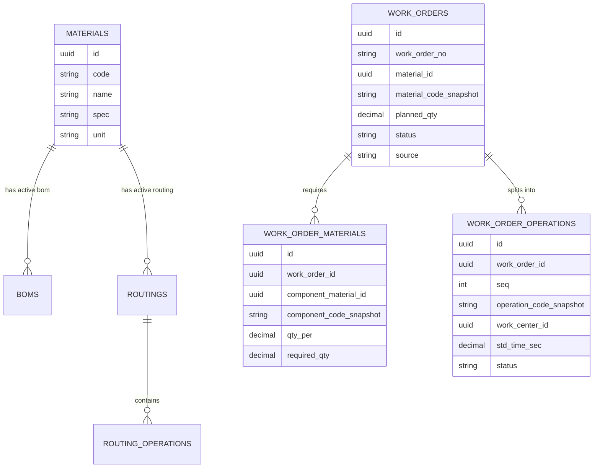

# 工单创建阶段详细规格

> 适用范围：创建 MES 工单时的 BOM 展开、工艺路线绑定、工序任务拆分。本文是 `mes-business-flows.md` 的落库级补充，目标是让后续代码实现有明确边界。

---

## 1. 阶段目标

工单创建阶段只做三件事：

1. 把一个生产需求固化成一张 `work_orders` 主表记录。
2. 按当前激活 BOM 生成该工单需要的物料需求快照。
3. 按当前激活工艺路线生成该工单的工序任务快照。

这一步不做排产、不扣库存、不自动派工、不做复杂齐套。创建成功后，系统得到一份“可执行但尚未执行”的车间任务蓝图。

---

## 2. 输入契约

### 2.1 创建工单请求

```http
POST /api/v1/work-orders
Idempotency-Key: <uuid-from-client>
Content-Type: application/json

{
  "material_code": "P-001",
  "quantity": "100",
  "due_date": "2026-06-01",
  "priority": "normal",
  "source": "manual",
  "external_ref": "SO-2026-0001",
  "customer_name": "ACME",
  "remark": ""
}
```

### 2.2 字段规则

| 字段 | 必填 | 规则 |
|------|------|------|
| `material_code` | 是 | 必须存在于物料档案，且未软删除 |
| `quantity` | 是 | Decimal，必须大于 0 |
| `due_date` | 否 | 允许为空，中小厂早期数据不强制 |
| `priority` | 否 | `normal/high/urgent`，默认 `normal` |
| `source` | 是 | `manual/erp` |
| `external_ref` | 否 | ERP 单号、销售订单号或计划单号 |
| `customer_name` | 否 | 快照字段，只用于看板和查询 |
| `remark` | 否 | 备注 |

### 2.3 幂等要求

创建工单是写入接口，必须支持 `Idempotency-Key`。

- 同一个 `Idempotency-Key` 在 24 小时内重复提交，返回第一次创建结果。
- 如果重复提交的请求体与第一次不同，返回 `409 IDEMPOTENCY_PAYLOAD_MISMATCH`。
- 服务端要在同一个数据库事务内保存幂等记录和工单创建结果。

---

## 3. 核心数据关系



---

## 4. 事务流程

创建工单必须在一个数据库事务内完成：

```text
BEGIN
  1. 校验幂等键
  2. 锁定并读取物料档案
  3. 读取当前激活 BOM
  4. 读取当前激活工艺路线及工序
  5. 生成工单号
  6. 写 work_orders
  7. 写 work_order_materials
  8. 写 work_order_operations
  9. 写 audit_logs
 10. 保存幂等结果
COMMIT
```

任意一步失败都回滚，不允许出现“有工单主表但没有工序”的半成品数据。

---

## 5. 校验顺序

按下面顺序校验，错误尽量早返回：

1. `Idempotency-Key` 是否存在。
2. `quantity > 0`。
3. `source` 是否为 `manual` 或 `erp`。
4. `priority` 是否为合法枚举。
5. 物料是否存在且可生产：`materials.type in ('product', 'semi_finished')`。
6. 是否存在当前激活 BOM。
7. 是否存在当前激活工艺路线。
8. 工艺路线下是否至少有一道有效工序。
9. 每道工序是否绑定有效工位。

### 5.1 BOM 为空的处理

MVP 默认要求生产物料必须有 BOM。如果客户确实存在“不需要领料”的生产任务，使用显式开关：

```text
materials.allow_empty_bom = true
```

没有这个开关时，BOM 为空返回 `400 ACTIVE_BOM_NOT_FOUND`。

### 5.2 工艺路线为空的处理

工艺路线不能为空。没有工艺路线就无法生成工序任务，应返回 `400 ACTIVE_ROUTING_NOT_FOUND` 或 `400 ROUTING_OPERATIONS_EMPTY`。

---

## 6. BOM 展开规则

### 6.1 版本选择

只取当前激活版本：

```text
boms.material_id = target_material.id
boms.status = 'active'
boms.effective_from <= now
(boms.effective_to is null or boms.effective_to > now)
```

如果存在多个同时激活版本，返回 `409 MULTIPLE_ACTIVE_BOMS`，让管理员修基础数据，不要替客户猜。

### 6.2 展开深度

一期只展开一层 BOM。

```text
成品 P-001
  ├─ 原料 M-A001
  └─ 半成品 S-B001
```

创建 `P-001` 工单时，`work_order_materials` 只写 `M-A001` 和 `S-B001`。如果 `S-B001` 也要生产，由计划员或 ERP 另建半成品工单，不在这里递归展开。

### 6.3 数量计算

```text
required_qty = work_order.planned_qty × bom_line.qty_per × (1 + loss_rate)
```

字段建议：

| 字段 | 来源 | 说明 |
|------|------|------|
| `qty_per` | BOM 行 | 单件成品消耗量 |
| `loss_rate` | BOM 行 | 损耗率，默认 0 |
| `required_qty` | 计算 | 计划需求量 |
| `issued_qty` | 初始 0 | WMS 发料后回写 |
| `consumed_qty` | 初始 0 | 报工反冲后累计 |

数量全部用 Decimal，不允许 float。

### 6.4 必须保存快照

BOM 后续可能被修改，所以工单物料需求必须保存当时快照：

```text
work_order_materials
  work_order_id
  bom_id
  bom_version
  bom_line_id
  component_material_id
  component_code_snapshot
  component_name_snapshot
  component_spec_snapshot
  component_unit_snapshot
  qty_per
  loss_rate
  required_qty
  issued_qty = 0
  consumed_qty = 0
```

快照不是冗余浪费，是追溯需要。

---

## 7. 工艺路线绑定规则

### 7.1 版本选择

只取当前激活工艺路线：

```text
routings.material_id = target_material.id
routings.status = 'active'
routings.effective_from <= now
(routings.effective_to is null or routings.effective_to > now)
```

如果有多个激活版本，返回 `409 MULTIPLE_ACTIVE_ROUTINGS`。

### 7.2 工序排序

按 `routing_operations.seq asc` 生成工序。建议序号用 `10, 20, 30`，方便以后插入临时工序。

一期默认串行工艺：

```text
10 下料 → 20 CNC → 30 去毛刺 → 40 终检
```

并行工序、可跳过工序、返修路线都不进 MVP。确实需要时，先在文档里明确业务规则再写代码。

### 7.3 标准工时计算口径

推荐在工艺路线明细里拆两个字段：

```text
setup_time_sec      准备/换型时间，按工单计一次
unit_time_sec       单件加工时间
```

创建工序任务时计算：

```text
planned_duration_sec = setup_time_sec + unit_time_sec × work_order.planned_qty
```

如果早期只有一个 `std_time_sec` 字段，则统一按单件工时理解：

```text
planned_duration_sec = std_time_sec × work_order.planned_qty
```

不要在一期做复杂节拍模型。

---

## 8. 工序拆分规则

每条 `routing_operations` 生成一条 `work_order_operations`：

```text
work_order_operations
  work_order_id
  seq
  operation_code_snapshot
  operation_name_snapshot
  work_center_id
  work_center_code_snapshot
  work_center_name_snapshot
  setup_time_sec
  unit_time_sec
  planned_duration_sec
  planned_qty
  good_qty = 0
  bad_qty = 0
  status = 'pending'
```

### 8.1 初始状态

所有工序初始都用 `pending`。

- 不要在创建工单时直接把第一道工序设为 `ready`。
- `ready` 应该由齐套检查或排产派工触发。
- 手工创建的工单状态为 `draft`，工序也保持 `pending`。
- ERP 同步来的工单状态为 `pending`，工序仍保持 `pending`。

### 8.2 工序数量

每道工序的 `planned_qty` 默认等于工单计划数量。

中小 MES 一期不处理复杂的工序损耗滚动计划。实际损耗通过报工的 `good_qty/bad_qty` 记录，后续工序允许用上道合格数作为开工上限。

---

## 9. 工单主表写入规则

### 9.1 工单号

格式：

```text
WO-YYYYMM-NNNN
```

示例：

```text
WO-202605-0001
```

实现建议：

- 用 `document_sequences` 表按月份维护流水号。
- 生成时对对应月份行加行级锁。
- `work_orders.work_order_no` 必须有唯一索引。

不要用“查最大号 + 1”的裸查询，会并发撞号。

### 9.2 状态

```text
source = manual → status = draft
source = erp    → status = pending
```

原因：

- 手工创建容易录错，需要确认动作。
- ERP 同步默认已经过上游计划确认，可直接进入待排产。

### 9.3 主表快照字段

```text
work_orders
  id
  tenant_id
  work_order_no
  source
  external_ref
  material_id
  material_code_snapshot
  material_name_snapshot
  material_spec_snapshot
  material_unit_snapshot
  planned_qty
  actual_good_qty = 0
  actual_bad_qty = 0
  due_date
  priority
  customer_name
  status
  bom_id
  bom_version
  routing_id
  routing_version
  created_by
  created_at
  updated_at
  deleted_at
```

---

## 10. 成功响应

```json
{
  "work_order_no": "WO-202605-0001",
  "status": "draft",
  "material": {
    "code": "P-001",
    "name": "泵体组件",
    "unit": "pcs"
  },
  "planned_qty": "100",
  "bom": {
    "version": "BOM-2026-01",
    "material_lines": 2
  },
  "routing": {
    "version": "RT-2026-01",
    "operation_lines": 4
  },
  "materials_required": [
    {
      "material_code": "M-A001",
      "material_name": "铝棒",
      "required_qty": "105.000",
      "unit": "kg"
    }
  ],
  "operations": [
    {
      "seq": 10,
      "operation_name": "下料",
      "work_center_code": "WC-CUT-01",
      "planned_duration_sec": 1800,
      "status": "pending"
    }
  ]
}
```

---

## 11. 错误码

| HTTP | 错误码 | 场景 |
|------|--------|------|
| 400 | `IDEMPOTENCY_KEY_REQUIRED` | 缺少幂等键 |
| 400 | `INVALID_QUANTITY` | 数量小于等于 0 或格式错误 |
| 400 | `MATERIAL_NOT_FOUND` | 物料不存在 |
| 400 | `MATERIAL_NOT_PRODUCIBLE` | 物料不是可生产类型 |
| 400 | `ACTIVE_BOM_NOT_FOUND` | 没有激活 BOM |
| 400 | `ACTIVE_ROUTING_NOT_FOUND` | 没有激活工艺路线 |
| 400 | `ROUTING_OPERATIONS_EMPTY` | 工艺路线没有工序 |
| 400 | `WORK_CENTER_NOT_FOUND` | 工序绑定的工位不存在或停用 |
| 409 | `MULTIPLE_ACTIVE_BOMS` | 同时存在多个激活 BOM |
| 409 | `MULTIPLE_ACTIVE_ROUTINGS` | 同时存在多个激活工艺路线 |
| 409 | `IDEMPOTENCY_PAYLOAD_MISMATCH` | 幂等键重复但请求体不同 |

---

## 12. 伪代码

```python
def create_work_order(payload, idempotency_key, actor):
    assert idempotency_key

    with db.transaction():
        cached = idempotency_repo.find_for_update(idempotency_key)
        if cached:
            cached.assert_same_payload(payload)
            return cached.response

        material = material_repo.get_by_code_for_update(payload.material_code)
        validate_material_is_producible(material)
        validate_quantity(payload.quantity)

        bom = bom_repo.get_single_active(material.id, now())
        bom_lines = bom_repo.list_lines(bom.id)
        validate_bom_lines(bom_lines, material)

        routing = routing_repo.get_single_active(material.id, now())
        routing_ops = routing_repo.list_operations(routing.id)
        validate_routing_operations(routing_ops)

        work_order_no = sequence_service.next_work_order_no(now())

        work_order = work_order_repo.create(
            no=work_order_no,
            status="draft" if payload.source == "manual" else "pending",
            material_snapshot=snapshot(material),
            bom_snapshot=snapshot(bom),
            routing_snapshot=snapshot(routing),
            planned_qty=payload.quantity,
            source=payload.source,
        )

        material_rows = expand_bom(work_order, bom, bom_lines, payload.quantity)
        work_order_material_repo.bulk_create(material_rows)

        operation_rows = split_operations(work_order, routing, routing_ops, payload.quantity)
        work_order_operation_repo.bulk_create(operation_rows)

        audit_log_repo.create(
            entity_type="work_order",
            entity_id=work_order.id,
            action="create",
            actor=actor,
            detail={"status": work_order.status},
        )

        response = build_create_response(work_order, material_rows, operation_rows)
        idempotency_repo.save(idempotency_key, payload, response)
        return response
```

---

## 13. 验收用例

实现后至少覆盖这些测试：

1. 手工创建工单成功，状态为 `draft`。
2. ERP 创建工单成功，状态为 `pending`。
3. BOM 一层展开后 `required_qty` 计算正确。
4. 工艺路线按 `seq` 生成工序任务。
5. 工单、物料需求、工序任务在同一个事务内创建。
6. 缺物料档案时失败且不产生工单。
7. 缺 BOM 时失败且不产生工单。
8. 缺工艺路线时失败且不产生工单。
9. 多个激活 BOM 时返回 409。
10. 重复提交同一幂等键返回同一结果，不重复生成工单。
11. 同一幂等键不同请求体返回 409。
12. 工单号并发生成不重复。

---

## 14. 一期明确不做

为了保持短小精悍，工单创建阶段一期不做：

- 多层 BOM 自动递归展开
- 替代料自动选择
- 按库存自动拆分工单
- 自动齐套和库存锁定
- 自动排产
- 并行工序
- 返修路线
- 复杂版本优先级推断

这些能力都可以后续补，但不应该污染第一版工单创建主流程。
